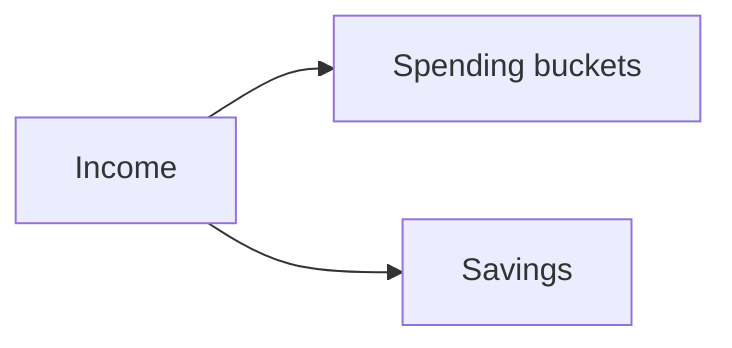
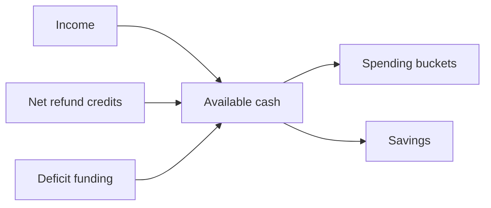
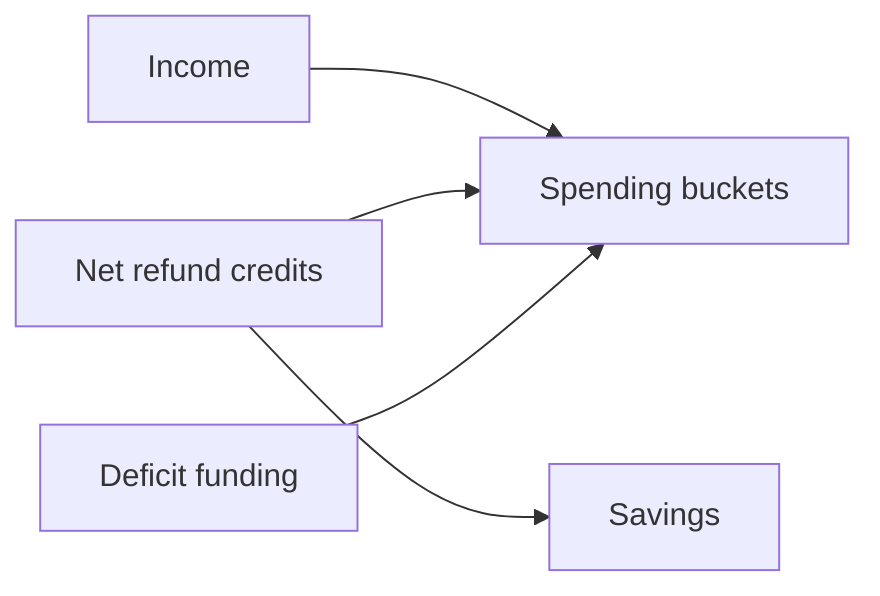

# PI-09 — Sankey composition exploration

## Decision boundary and current behavior

This is a presentation decision. It must not change the CF-14 accounting scope,
the meaning of `total_spend`, or the treatment of transfers and refunds.

Let:

- `I` = reported external income;
- `P` = sum of positive effective-category net spending;
- `C` = residual net refund credits, after refunds are netted within their
  effective category;
- `N = P - C` = signed net spending;
- `S = max(I + C - P, 0)` = savings;
- `D = max(P - I - C, 0)` = deficit funding.

The existing React chart in `SankeyChart.tsx` always creates an `Available cash`
hub. Income, `Net refund credits`, and (when needed) `Deficit funding` enter that
hub; positive bucket flows and Savings leave it. This is arithmetically balanced,
but the hub is present even in the ordinary income-to-spending case. The API
already supplies the positive bucket/category flows, income sources, `C`, `S`, and
`D`; PI-09 does not require an API contract change.

PI-06's diagnosis is a constraint here: a category label such as “Credit card
payments” is not enough to call the chart wrong. A confirmed linked card
repayment is excluded by shared accounting; an unresolved candidate or unpaired
row remains counted until evidence/review resolves it. Composition must not hide
or suppress a category to make the picture look cleaner.

## Reconciled cases

The examples below use presentation values, not new accounting rules. A zero
value source, destination, or flow may be omitted from the drawing.

| Case | I | P | C | N | S | D | Required truthful story |
|---|---:|---:|---:|---:|---:|---:|---|
| Normal surplus | 3,000 | 900 | 0 | 900 | 2,100 | 0 | Income pays spending and leaves Savings. |
| Exact balance | 900 | 900 | 0 | 900 | 0 | 0 | Income reaches spending; there is no artificial Savings node. |
| Deficit | 900 | 1,200 | 0 | 1,200 | 0 | 300 | Income plus separately labeled Deficit funding pays spending. |
| Refund credit (CF-02 February) | 3,000 | 90 | 120 | -30 | 3,030 | 0 | Net refund credits remain visibly distinct from Income; the residual credit increases available capacity. |
| Refund-only period with income | 3,000 | 0 | 120 | -120 | 3,120 | 0 | The refund is a credit and not income; no fabricated spending bucket is shown. |
| Refund-only, zero income | 0 | 0 | 120 | -120 | 120 | 0 | The credit is still not income; it can flow to Savings or an explicit credit explanation. |
| Zero income, spending | 0 | 100 | 0 | 100 | 0 | 100 | Deficit funding is visible and is not renamed as Income. |
| Net-zero category | 1,000 | 100 | 100 | 0 | 1,000 | 0 | The category has no net spending flow; its underlying transactions remain available to Activity/evidence. |

For the refund-credit case, `I + C = 3,120 = P + S`; for the deficit case,
`I + C + D = 1,200 = P + S`. These identities are the acceptance boundary for
any implementation. In particular, `C` is not added to `I`, and `D` is not a
positive income source.

## Design A — adaptive allocation hub (recommended)

Remove `Available cash` only when `C = 0` and `D = 0`. In that common case, draw
Income directly to positive spending buckets and Savings. For exact balance,
omit Savings. For a surplus, the direct links are `Income -> P` and
`Income -> (I - P) Savings`.

When `C > 0` or `D > 0`, retain the current explicit allocation stage. Draw each
non-zero source separately into `Available cash`, with the labels `Net refund
credits` and `Deficit funding` unchanged, then draw Available cash to positive
spending buckets and Savings. This avoids inventing a causal assignment of a
refund credit or deficit dollars to an individual spending bucket while keeping
the exceptional arithmetic visible.

Ordinary case: `Income -> spending buckets` is `P`; `Income -> Savings` is
`I - P`. The diagram has no persistent hub and no zero-width exception nodes.

Exceptional case: only sources and destinations with positive values are shown.
For a refund-only period, `Credits -> Available cash -> Savings` is sufficient;
for zero-income deficit, `Deficit funding -> Available cash -> spending` is
shown. The explanatory text remains attached to the refund source/section:
“Refunds remaining after offsetting spending in the same category. Not income.”

### Why this is the recommendation

- Common-case simplicity: the hub disappears for the dominant income/spending/
  savings flow.
- Truthful exceptions: residual credits and deficit funding have distinct names
  and visible paths; neither is silently folded into Income.
- Accounting: the hub branch is exactly the existing CF-14-balanced composition.
- Expansion/drilldown: positive bucket/category nodes retain their existing
  stable bucket/category identities and amounts. No displayed aggregate is
  redefined by the visual optimization.
- Narrow screens: the ordinary case loses a whole column and its labels; the
  exceptional branch may remain taller, but it is less frequent and can be
  accompanied by the concise refund explanation.
- Maintenance: the branch condition is small and local. It reuses existing API
  values and avoids a new source-allocation matrix.

## Design B — direct multi-source allocation

Omit `Available cash` in every case. Keep Income, Net refund credits, and
Deficit funding as distinct source nodes and connect them directly to spending
buckets and/or Savings. Use a deterministic presentation allocation: satisfy
positive spending `P` from Income first, then residual credits `C`, then Deficit
funding `D`; any remaining Income or Credits flow to Savings. This is a drawing
convention only and does not change transaction accounting.

This handles the examples: normal surplus is Income to spending plus Savings;
refund-only is Credits to Savings; and zero-income deficit is Deficit funding to
spending. A refund-credit surplus would show Income covering `P`, Income's
remainder to Savings, and Credits to Savings. A deficit with credits would show
the source-priority split across the spending destination.

### Tradeoffs

- It removes the hub in every case and can be compact when there are few
  buckets.
- It introduces presentation-only attribution: a user may reasonably read a
  `Net refund credits -> FOOD` link as saying the refund funded FOOD, even when
  the credit belongs to a different category and the API only guarantees the
  aggregate identities.
- Multiple source-to-bucket links become visually busy when there are many
  categories, and Income expansion multiplies that clutter.
- The source-priority algorithm becomes a second composition rule that needs
  tests for rounding, category order, expansion, and mixed exceptions. It is
  more maintenance for little benefit in the common case.

## Comparison

| Dimension | A: adaptive hub | B: direct multi-source |
|---|---|---|
| Common-case simplicity | Best: one fewer node/column and direct Income flows | Good with few buckets, but source links can multiply |
| Exceptional truthfulness | Best: no arbitrary source attribution; explicit exception hub | Adequate numerically, but links imply presentation-only causality |
| Expansion/drilldown | Reuses existing positive bucket/category paths | Reuses paths but requires source allocation to remain stable under expansion |
| Narrow-screen readability | Best ordinary case; exceptional case is intentionally richer | Can become crowded with several sources and buckets |
| Arithmetic balance | Existing hub equations, low risk | Requires new allocation matrix and rounding rules |
| Implementation/maintenance | Small conditional composition change | Larger new rule and test surface |

## Recommended bounded contract for PI-10

PI-10 should implement Design A with these observable rules:

1. If `C = 0` and `D = 0`, omit `Available cash`; render non-zero Income,
   positive spending buckets/categories, and Savings only when `S > 0`.
2. If `C > 0` or `D > 0`, retain `Available cash` as an explicit exception
   allocation stage. Include only non-zero source/destination nodes.
3. Always label `C` as `Net refund credits` and retain the explanatory copy that
   says it is residual after same-category netting and is not income. Never route
   it through an Income node or include it in the income-source breakdown.
4. Always label `D` as `Deficit funding`; never represent it as income or hide it
   when spending exceeds `I + C`.
5. Preserve the existing positive bucket/category identities and expansion
   behavior. A zero-net category has no drawable flow, but its transactions are
   not deleted and remain inspectable through the accounting/API evidence paths.
6. Keep every link non-negative and verify `P - C = N`,
   `S = max(I + C - P, 0)`, and `D = max(P - I - C, 0)` in the API fixture and
   rendered graph tests. Confirmed linked card repayments remain excluded by the
   shared accounting scope; unresolved candidates/unpaired rows remain governed
   by PI-06/CF-14 rather than by chart composition.

The exception hub is intentionally not deleted from the product; it is hidden
only when it contributes no exceptional information. This preserves a truthful,
readable explanation for refund-credit and deficit periods without permanently
making normal cashflow look like an accounting reconciliation diagram.

## Decisions, evidence, and escalation

The recommendation is a design inference from the accepted PI-09 brief, CF-14,
the CF-02 hand-calculated fixture, and inspection of the current chart/API. No
new user feedback was collected during this task. No user decision is genuinely
required before PI-10: this is a bounded presentation choice and preserves the
stated accounting/drilldown contract. If the product owner prefers direct
multi-source attribution despite its causal ambiguity, that is a deliberate UX
choice and should replace this recommendation before PI-10; it must not be
silently mixed with the adaptive-hub contract.

No escalation is raised. PI-09 does not resolve the separate PI-06/PI-19 issue of
which concrete observed rows produced a card-payment category; the composition
must remain correct under either confirmed-transfer or unresolved-candidate
evidence.

## Verification performed

- Read `PI-06-card-payment-sankey-audit.md`, CF-14, CF-02, the CF-02 JSON
  fixture, `app/api/routes.py`, `frontend/src/components/finance/charts/SankeyChart.tsx`,
  its focused React test, and the focused Insights/accounting tests.
- No product code, PI-06, or frozen TDD contract was changed.
